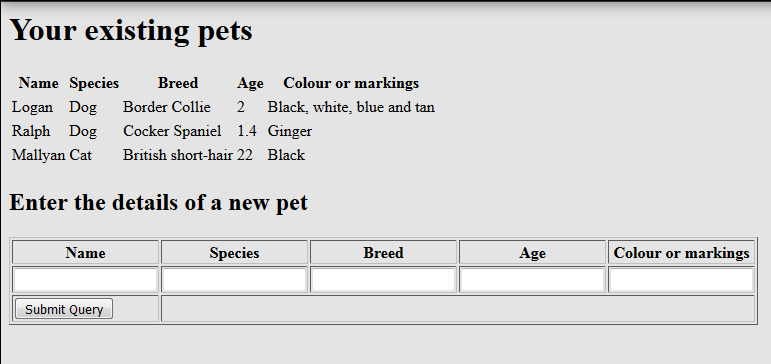

# Week 06 - Express

This material can be found in this [link](https://codeberg.org/kaduardo/shu-aaf/src/branch/main/week06-Express/readme.md).

## 1. Introduction

In this lab we are going to build a simple petshop application using Express framework for programming the backend, mongodb database and pug to create our pages.
The tutorial starts with some "recipe" material, which you can follow along, before asking you to dive into the deep end and refactor the code.

These exercises assume you have finished last weeks exercises about nodejs.

You need a place to hold your work. You should make a directory in which your work can be stored. Open a terminal and change to the new directory.
These instruction will assume the name of your main project folder is `petshop` and that you are starting your project from scratch.

## 2. Set-up the node.js application

let's start working on our nodejs application.
Since we will use express the first step is to install it in your machine.
You can install it in your system by running the following command:

```bash
npm install -g express-generator
```

Now you can use express to initialise your node.js application. From inside the `petshop` folder run the following command:

```bash
express --view=pug pets
```

This will create a new folder called `pets`, resulting in your code being saved in the `petshop/pets` folder.
You can check your current application by changing into the `pets` directory, installing the necessary dependencies and starting the application with the commands below:

```bash
cd pets

npm install

npm start
```

Now open your browser and navigate to <http://localhost:3000>.

## 3. Install modules/dependencies

You need a way to extract data from the post. In express this is done easily using the body-parser and multer packages. At the same time we'll install an HTML pre-processor with which we'll build a UI and a package that monitors and restarts node when our codebase changes. 
In the terminal run the following commands from inside the `pets` directory:

```bash
npm install --save body-parser
npm install --save multer
npm install --save pug
npm install -g nodemon
```

Or add them to `package.json` as dependencies. 
`Nodemon` watches for changes in your project and automatically stops and restarts the server when it detects changed files.

Now you need to instruct npm to download and locally install the indicated dependencies. Do this by running the command:

```bash
npm update
npm install
```

Start your application by executing one of these commands in a terminal

```bash
npm start
nodemon start
```

Navigate to <http://localhost:3000> and you should see a welcome message.

## 4. Creating the routes

We’ll start by setting up and testing some routes. If working on your own machine you may find the Chrome plugin Postman or the Firefox extension Rest Easy useful to test different HTTP methods.

Begin by creating a new routing file called `pets.js` in the `routes` directory of your application.
Add the code below to this file.

```javascript
var express = require('express');
var router = express.Router();
 
// GET at the root just to demonstrate
router.get('/', function(req, res, next) {
   res.send('got a GET request at /');
});
 
// GET list of pets to show that we're up and running
router.get('/pet', function(req, res, next) {
  res.send('Got a GET request at /pet');
});
 
// accept POST request and add a new pet to the db
//router.post('/pet', upload.array(), function (req, res) {
//    res.send('Got a POST request at /pet');
//});
 
// accept PUT request at /pet
router.put('/pet', function (req, res) {
 res.send('Got a PUT request at /pet');
});
 
 
// accept DELETE request at /pet
router.delete('/pet', function (req, res) {
 res.send('Got a DELETE request at /pet');
});
 
module.exports = router;
```

You’ll need to edit your `app.js` file to require your new `pets.js` module. 
Assign it to a variable called `petsRouter` then add a new `use` statement:

```javascript
// Assigning the router to a local variable
var petsRouter = require('./routes/pets');

//...

// Indicating the path this router will be responsible for
app.use('/petshop', petsRouter);
```

Restart your server and test the routes you now have. If you can, try using different HTTP methods, too (if you’ve got postman installed you can use this).
A few examples:

- <http://localhost:3000/>
- <http://localhost:3000/petshop>
- <http://localhost:3000/petshop/pet>
- <http://localhost:3000/petshop/pet?n=2>
- <http://localhost:3000/petshop/pet/dog>
- <http://localhost:3000/pets/>

Reflect on what is happening. Can you identify which function is responsible for answering each path? Are you able to add a new path?

## 5. Making the pages using Pug

In a default express installation HTML pages are created from a templating language called Pug. If you look in the views folder of your project you’ll see three default templates.

In `app.js` you need to make sure that the **view engine** is set to pug.

Now create a new file in `views` called `pets.pug`. This is where you’ll place your template code.
You can use the following code for your template:

```javascript
html
  head
    title!= title
  body
    h1!= message
```

Notice how the template uses two variables (`title` and `message`). We need to change the `/pet` route so that data that is needed in the template is passed in. 
Modify the `routes/pets.js` router with:

```javascript
router.get('/pet', function(req, res, next) {
    res.render('pets', 
        {title: 'Pet store',
        message: 'Hello World! from the <tt>pets</tt> router'}
    );
});
```

Test your new view. You should see some nice HTML returned. Check the page source to confirm it.

Here is an example Pug template with a simple table of data. In the finished application the table will be generated from a database query and interpolated into the table by the engine. The dash and space before the variable are significant. You need them. The indentation really matters - use spaces not tabs.
Save the following template as `pets.pug` (you need the leading dash and space before the variable)

```
- var dog = { name:'Logan', species:'Dog', breed:'Border Collie', age:'2.5', colour:'Black with white, blue and tan head' }
html
  head
    title!= title
  body
    h1 !{message}
    table(border='1')
      thead
         th Name
         th Species
         th Breed
         th Age
         th Colour or markings
      tbody
         td #{dog.name}
         td #{dog.species}
         td #{dog.breed}
         td #{dog.age}
         td #{dog.colour}
```

Test your new view. You should be able to identify the HTML table generated from the variables in the template.

Try this to demonstrate how to handle multiple rows of data:

```
- var animals = [{ name:'Logan', species:'Dog', breed:'Border Collie', age:'5', colour:'Black with white, blue and tan head' }, {name:'Archie', species:'Dog', breed:'Mongrel', age:'15.5', colour:'White' }]

tbody
     each pet in animals
        tr
           td #{pet.name}
           td #{pet.species}
           td #{pet.breed}
           td #{pet.age}
           td #{pet.colour}
```

Try to pass the data to the template from the `/pet GET` route handler. You’ll need to remove it from the template itself. Do this by creating an array in the route handler and passing that to the template as the parameter animals.

## 6. Adding a form to your pug page

Using the documentation for Pug at <https://pugjs.org/api/getting-started.html> and <https://medium.com/@nima.2004hkh/create-your-first-login-page-with-exprerssjs-pug-f42250229486> modify your template so that it includes a form you can use to add new pets. Call the fields `name`, `species`, `breed`, `age` and `colour`. You should use the `HTTP POST` verb and the action should be `/petshop/pet`. You should try to make a page that looks something like this



Here is an example of the main form code using pug for your reference:

```
   h1 Enter the details of a new pet
   form(action="/petshop/pet" method="POST")
     table(border='1')
       thead
         th Name
         th Species
         th Breed
         th Age
         th Colour or markings
       tbody
         td
           input(type="text", name="name")
         td
           input(type="text", name="species")
         td
           input(type="text", name="breed")
         td
           input(type="text", name="age")
         td
           input(type="text", name="colour")
         tr
         td
           button(type="submit") Submit
```

You’ll need a route to handle the data from this form. Using the HTTP POST method and `/petshop/pet` is a sensible and RESTful URL for the endpoint. Uncomment the supplied `router.post` function, presented below as reference.

```javascript
router.post('/pet', upload.array(), function (req, res) {
    res.send('Got a POST request at /pet');
});
```

Now you need to add the new packages to the router. The following code makes them available in `pets.js` and creates an instance of multer which we will use to extract form data from the POST:

```javascript
var bodyParser = require('body-parser');
var multer = require('multer'); 
var upload = multer(); 
```

Now change the POST handler to look like this:

```javascript
router.post('/pet', upload.array(), function (req, res) {
    res.send('Post handler at /petshop received '+ req.body.name 
            +' '+ req.body.breed);
});
```

You can now test your new handler by sending a POST request to <http://localhost:3000/petshop/pet> where the body is a pet in json format.
You can do that using Postman or any of the plugins you chose to use.
Here is one example of the json format to be used.

```json
{"name":"Scooby Doo", "species":"Dog", "breed":"Great Dane", "age":"51", "colour":"Browinsh with black spots"}
```

This is one example using the cURL tool (linux based machines):

```bash
curl -X POST -H "Content-Type: application/json" -d '{"name":"Scooby Doo", "species":"Dog", "breed":"Great Dane", "age":"51", "colour":"Browinsh with black spots"}' http://localhost:3000/petshop/pet
```

Now that your handler is able to receive POST requests and extract information from the body we can pass this information forward.
Let's add the newly arrived data to the local array, and have the POST handler reload the page with the new data added to the table at the top each time that it receives a new pet. Do this by using the response object’s redirect method.

Your POST handler will look list this:

```javascript
// accept POST request and add a new pet to the db
router.post('/pet', upload.array(), function (req, res) {
    animalsList.push(req.body);
    res.redirect('/petshop/pet');
});
```

Now try your application in the browser.
Start by accessing the main list page: <http://localhost:3000/petshop/pet>, then add a few entries using the form.
Notice in the console the POST request followed by a GET request.

## 7. Creating the database

We’re now going to use a mongo database to store information about our pets.

If you haven't done so you should now install the nodejs mongodb module with the following command:

```bash
npm install mongodb --save
```

Run your project to make sure that nothing got broken during the installation (`npm update` and `npm install`).

We need to start the mongodb server. Remember about the data directory for your database.
In these instructions we are assuming you have a data folder insider your petshop folder, i.e., `petshop/data`. Start your mongodb server. Here is the general format of the command (remember to modify it to reflect your environment):

```bash
<path-to-mongo-bin>/mongod --dbpath=<path-to-your-data-directory> --nojournal
```

Now that you mongodb server is up and running let's create a database and populate with some data.
Using the command line terminal create a new database called `petshopdb` and create a new collection called `animal`. You can use the commands below for doing that from inside the `mongo` command line client.

```bash
use petshopdb 

db.createCollection("animals")

db.animals.insertMany([
{ 'name': 'Logan', 'species': 'dog', 'breed': 'Border Collie', 'age': 5, 'colour': 'tricolour' },     
{ 'name': 'Ralph', 'species': 'dog', 'breed': 'Cocker Spaniel', 'age': 2, 'colour': 'golden' },     
{ 'name': 'Mallyan', 'species': 'cat', 'breed': 'British Short Hair', 'age': 22, 'colour': 'black' } 
])
```

Try to display all of the data in the mongo client (e.g., `db.animals.find()`).

## 8. Adding database handling code

### Reading data

Our first task is to read some data from the database and format it neatly. 
We’ll begin by adding in the database libraries and creating a connection object. Add these lines to the top of `pets.js`:

```javascript
const MongoClient = require('mongodb').MongoClient;
const url = 'mongodb://localhost:27017';
const dbName = 'petshopdb';
const client = new MongoClient(url);
```

Now we need to read from the database and return data to the client. Change your GET handler (in `routes/pets.js`) to be:

```javascript
// GET list of pets to show that we're up and running
router.get('/pet', function(req, res, next) {
    client.connect(function(err) { 
        const db = client.db(dbName);
        const collection = db.collection('animals');
        collection.find({}).toArray(function(err, data) {
            res.render('pets', {title:'Pet store', animals:data});
        });
    });
});

```

Save everything and check wether your view (`pets.pug`) is correctly listing the elements from your database.
At this point you should be able to list the elements from the mongodb database but not add any element.

### Writing data

Let's modify our code to add elements to the database.

First we need to modify the POST handler (in `routes/pets.js`) to extract the data from the HTTP request and then save it in the database.
Use the following code for doing that (if the fields in your form have different names you’ll need to do some editing):

```javascript
// accept POST request and add a new pet to the db
router.post('/pet', upload.array(), function (req, res) {
    let nu = { name:req.body.name, species:req.body.species, breed:req.body.breed, age:req.body.age, colour:req.body.colour };

    client.connect(function(err) {
        const db = client.db(dbName);
        const collection = db.collection('animals');
        collection.insertOne(nu, function(err, result) {
            if(err != null) { console.log(err);}
            res.redirect('/petshop/pet');
        });
    });
});
```

Save everything and play around with the form. Try adding a few animals to the database and check using the `mongo` client console if the animals are indeed saved in the database.
What kind of output do you have in the node console (the one where you the node server)?
Add a few `console.log` throuhgout your code to track the sequence in which functions are called.

## 9. Refactorings

Here are some additional things that you can do with your code to turn this into a more fully-realised application.

1. Implement the ability to edit each item. You can do this by using the _id field that MongoDB generates for each document and a simple form. 
2. Add error handling code for database calls.
3. Add additional code to return HTTP status errors if resources (including routes) are unavailable
4. Add some style to the page. 
5. Modify the application so that each pet can be represented by a small avatar. Display the avatar as a circular image
6. The database access looks a bit ugly inside the handler methods. In fact we have spaghetti code here. Move it from there into a JavaScript file of its own which will work as a Data Access Layer to provide abstraction of the database code from the rest of the application and allow the building of a sensible model layer. While you are at it, separate the handling code from the routers.
7. (Optional) Change the view engine to {{mustache}} (https://github.com/janl/mustache.js)
