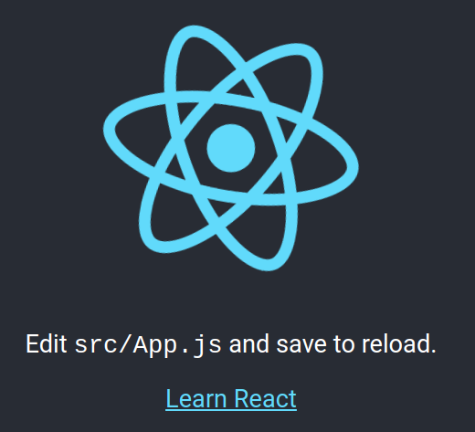
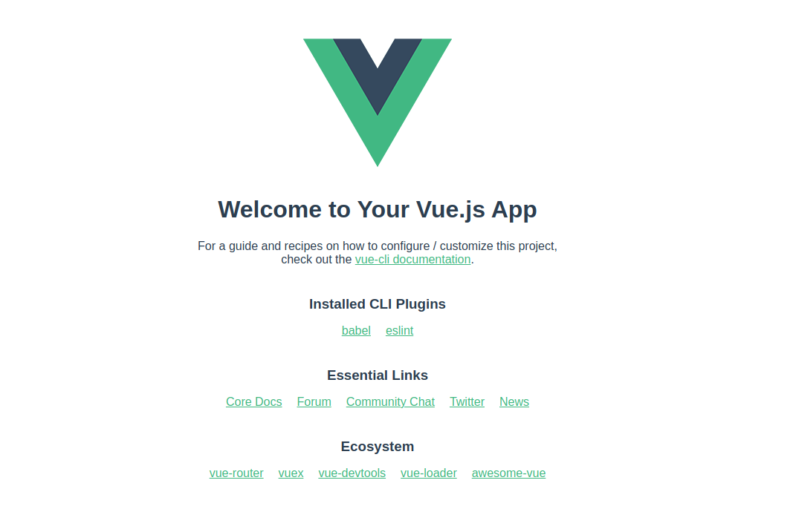
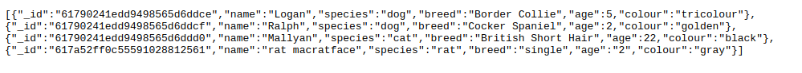
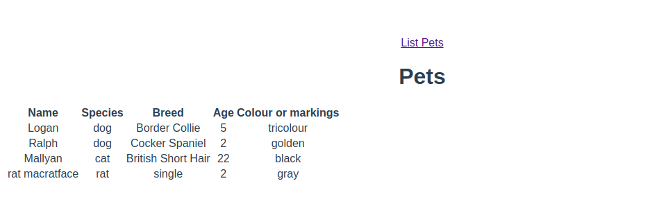

# Week 08 - Front-end (React)

This material can be found in this [link](https://codeberg.org/kaduardo/shu-aaf/src/branch/main/week08-front-end/).

## 1. Introduction

This week you will build a front-end for a Web application. 
We'll start by modifying the existing petshop application to remove pug and make sure our endpoints are fully RESTful and return JSON objects.

You will then move on to building an implementation of a frontend for the petshop application exploring two front-end frameworks: React and Vue. The objective is for you to experiment with both of them and select one to use in your project.

## 2. Refactoring the back-end

We will begin by restructuring your express/pug project so that it is accessible from other applications and so that it return JSON rather than rendered HTML pages. At this point we are removing the requirement for pug.

Make a copy of you petshop project and open it in your IDE/editor. In these instructions we are assuming the name of the new project to be `pets-backend`.

*We have provided a version that can be used as starting point in the repository ([solutions/pets-with-pug](solutions/pets-with-pug)). Make sure to run `npm install` before starting the application.

### 2.1. Configuration

We will start by configuring the project so that it runs on a different port. 
In the `bin` folder you will find a file called `www`. Look for the following line and change the port to be **3050**:

```javascript
var port = normalizePort(process.env.PORT || '3000');
```

You can test your application by accessing <http://localhost:3050/petshop>.

*Don't forget to start you mongodb database.* 

### 2.2. Returning JSON

Now we want to change the project so that it returns JSON documents to calling clients rather than rendering its results as HTML. The only changes that you need to make are in the file that holds the route endpoints (`routes/pets.js`).

Start with the GET `/pet` route. 

- Comment out the lines that return data either directly or by rendering the template.
- Replace the error condition’s return with
```javascript
return res.status(500).send({ 
    message: err.message || "Some error occurred while retrieving Animals." });
```
- Replace the success condition’s return with
```javascript
return res.send(data);
```

This is one example of the `GET /pet` route after the modifications. Remember this is here just as a reference as you should be working on your own code from the previous weeks.

```javascript
//GET list of pets from the database
router.get('/pet', function (req, res, next) {
  client.connect(function (err) {
    const db = client.db(dbName);
    const collection = db.collection('animals');
    collection.find({}).toArray(function (err, data) {
        if (err != null) {
            console.log(err);
             return res.status(500).send({ 
                    message: err.message || "Some error occurred while retrieving Animals." });
        }
        return res.send(data);
    });
  });
});
```

Now working with the POST route.

- Comment out and replace the return with
```javascript
return res.send(result);
```
- Replace the error condition’s return with
```javascript
return res.status(500).send({
                message:
                err.message || "Some error occurred while creating the animal."});
```

For your reference this is one example of the `POST /pet` route after the changes.

```javascript
// accept POST request and add a new pet to the db
router.post('/pet', upload.array(), function (req, res) {
  let nu = {
    name: req.body.name,
    species: req.body.species,
    breed: req.body.breed,
    age: req.body.age,
    colour: req.body.colour
  };

  client.connect(function(err) {
    const db = client.db(dbName);
    const collection = db.collection('animals');
    collection.insertOne(nu, function(err, result) {
      if (err != null) {
        console.log(err);
        return res.status(500).send({
                message:
                err.message || "Some error occurred while creating the animal."});
      }
      return res.send(result);
    });
  });   
});
```

Now you need to test your backend. Access the GET route (don’t forget the change of port) from the browser and you should get some JSON back.

## 3. Creating a React front-end

Now you're going to create your front-end application using the React framework.

Use the documentation at <https://reactjs.org/docs/getting-started.html> to help you with this task.

### 3.1. Set-up and initialisation

You need to begin by creating a React application. You don’t have to install anything yet - that will magically be done for you. Open a command prompt or terminal and change to a new directory where you want to store your React files. This should not be the same place as your express work from last week.

In these instructions we are assuming your React front-end is in the `pets-frontend-react` directory.

Type the following instructions:

```bash
npx create-react-app pets-frontend-react
cd pets-frontend-react
npm start
```

The npx command should be installed in the same directory as your npm and node executables. You will need to put the full path to it in the command if running on a SHU lab machine.

The framework will launch your default browser once it has started the server. You should see something that looks like the image shown below.



### 3.2. Creating components

We will begin by adding two components using each of the available types.

#### Components as functions

Our first function is a simple Hello World. Add a new file to the `src` directory called `Animals.js` to your project and put the following code into it.

```javascript
import React from 'react';

const Animals = (props) => {
   return ( <p>This is a simple component</p> );
}

export default Animals;
```

You will now need to import the file into `App.js`. Put this line at the top of the file

```javascript
import Animals from './Animals';
```

At the same time edit App.js:

- Remove all of the code that is inside the `<div>` element in the `App()` function. 
- Put this line of code into the `<div>` element: `<Animals />`

The project will rebuild and restart automatically. You should now see a line of text in the browser window.

#### Components as classes

Let’s make a class-based version of the same component. Create a file called `AnimalsClass.js` with the following code:

```javascript
import React, { Component } from 'react';

class AnimalsClass extends Component {
   constructor(props) {
       super(props);
   } 

   render() {
       return (
           <div>
               <p>A simple class-based component</p>
           </div>
       );
   }
}

export default AnimalsClass;
```

Import the file into `App.js` and add an instance of the class to the `<div>` element of the `App()` function. 

The project will rebuild and restart automatically. You should now see another line of text in the browser window.

### 3.3. Using state and props

Now that we have some working components let’s put some data into them. We will modify the class component (`AnimalsClass`) so that it defines a list, and the function component (`Animals`) so that it represents an item within the list. The former will hold data in its (mutable) state and the latter in its immutable props object.

#### The function-based component

This is a very simple component. It will receive some data in its `props` object and will display some (or all) of that data. The data will be passed on the object hierarchy from the dynamic class-based component.
Change the return call in `Animals.js` to:

```javascript
const Animals = (props) => {
   return (
       <li>The next animal is {props.name}</li>
   );
}
```

#### The class-based component

This component (`AnimalsClass`) is far richer. Because it has state it will be dynamic. We’ll start with a simple component that instantiates a list and an `Animal` but is otherwise static. Notice the import of the `Animals` component, that it passes data into that component to hold in its props and that there is a simple constructor.

```javascript
import React, { Component } from 'react';
import Animals from './Animals';

class AnimalsClass extends Component {
   constructor(props) {
       super(props);
   } 

   render() {
       return (
           <div>
               <ul>
                   <Animals name="Fido" />
               </ul>
           </div>
       );
   }

}

export default AnimalsClass
```

Modify the constructor so that it holds some state. Add this code after the `super(props)` call.

```javascript
this.state = {
     pets: [],
     error: null
};
```

And now we need to use the state object. Let’s change the render method again:

```javascript
render() {
    let data = this.state.pets || {};
    return (
        <div>
            <p>Here are the pets</p>
            <ul>
                {data}
            </ul>
        </div>
    );
}
```

Now when the page refreshes you won’t see anything but you have the infrastructure. Once the `state.pets` array is populated you will see new list items in the page. Notice that we initialise data with either of two values. The first time that the page loads `state.pets` will be an empty array, we’ll dynamically add data to it later. When the data held in `state` changes the page will reload automatically and will display the data.

We will change the state of the `AnimalsClass` component in response to it successfully loading. This code will go into a method named `componentDidMount` that is called once the page has finished loading the component. 

Add the following method inside your `AnimalsClass` class:

```javascript
componentDidMount() {
       let pets = [
           { id:"1", name:"Logan", age:"5", breed:"Border Collie", colour:"Black, white, tan" }, 
           { id:"2", name:"Ralph", age:"2", breed:"Cocker Spaniel", colour:"Ginger" },
           { id:"3", name:"Gryphon", age:"9", breed:"Staffie X", colour:"grey" }
       ];
       let temp = [];

       pets.forEach(item => {
           temp.push(<Animals
               key={item.id}
               name={item.name}
               age={item.age}
               breed={item.breed}
               colour={item.colour}
               />);
       });
       this.setState( {pets: temp} );
   }

```

Here we:

- Create an array of animals
- Iterate across the array, create an `Animals` component from each element and add the component to an array. The braces around the call to get the value of each property within the `forEach` loop are important.
- Change the state of the component by adding the array of animals to it. Notice the use of the `setState()` method to do this.
- We set a property called `key` on each of the `Animals`. This is used by react to identify components that undergo change.

You should now see the names of the animals in the initial array shown in your Web page.

A reference solution up to this point can be found in `solutions/pets-frontend-react-no-backend`.

### 3.4. Connecting the UI to the backend

Our final stage is to wire the React frontend to the express backend. We’ll do this by changing the way in which the `componentDidMount` method fills the `state.pets` array. Here is some code that uses the fetch API (<https://alligator.io/js/fetch-api/>) to connect to a remote resource:

```javascript
    componentDidMount() {
        fetch('/petshop/pet')
        .then(data => data.json())
        .then(res => {
            if (res.error)
                this.setState({ error: res.message });

            let temp = [];
            res.forEach(item => {
                temp.push(
                    <Animals 
                        key = {item._id}
                        name = {item.name}
                        age = {item.age}
                        breed = {item.breed}
                        colour = {item.colour}
                    />
                );
            });
            this.setState( {pets: temp} );
        });
    }
```

The React project will reload but you won’t see any data. This is because of a cross-site page load security violation. We can avoid this by configuring a proxy with the React application. Open the `package.json` file of the React application and add the following item below the scripts section (items in the file need to be comma separated):

```
"proxy": "http://localhost:3050"
```

Now everything ought to work. You must restart the React application for the change to be loaded, which will open it in your browser, where you can see it connected to the database. 
Remember:

- You need to have the database running in a terminal.
- You must be running the backend in a second terminal.
- Run the frontend project from a third terminal.

### 3.5. Exercises with React

1. Modify the application so that the displayed data is in a table rather than a list.
2. Create a React form that can be used to send new pets to the backend. Store these in the database.
3. Add some error handling to the application so that invalid or meaningless data (or incomplete pets) cannot be added to the system. You may want to do this using an HTML5 form (<https://developer.mozilla.org/en-US/docs/Learn/HTML/Forms/Form_validation>).
4. Implement the ability of visualising only one pet. You can do this by using the _id field that MongoDB generates for each document. 
5. Now implement the ability to edit each item. You can do this by using the _id field that MongoDB generates for each document and a simple form. 
6. Add error handling code for database calls.
7. Add additional code to return HTTP status errors if resources (including routes) are unavailable.
8. Add some style to the page. Look at Bootstrap (<https://getbootstrap.com/docs/3.3/css/>) or Google’s Material design (<https://material.io/>) for inspiration or code.
9. Modify the application so that each pet can be represented by a small avatar. Display the avatar as a circular image.

## 4. Creating a Vue front-end

In this part of the lab you will build a front-end for the petshop Web application using Vue. You will begin by building simple components that demonstrate how the framework is used and how you can connect your frontend to the express petshop application from previous exercises. Use the documentation at <https://vuejs.org/v2/guide/#Getting-Started> to help you with this session.

### 4.1. Set-up and initialisation

You must make sure mongodb server and the express backend of the petshop application are running before starting.
The first step is to install the Vue CLI by running the command shown below:

```bash
npm install -g @vue/cli
```

This command installs Vue CLI globally and it can now be accessed from the terminal. Confirm Vue CLI installation by running:

```bash
vue --version
```

You can now create your Vue application. Open a command prompt or terminal and change to a new directory where you want to store your vue files. This should not be the same place as your express work.

Type the following command:

```bash
vue create pets-frontend-vue
```

You will be prompted to pick a preset. For now the default preset is fine. After vue CLI finishes creating your project you can see how it looks like by starting the application an opening it in your web browser

```bash
cd pets-frontend-vue
npm run serve
```

Open your browser at http://localhost:8080/. You should see something that looks like the image below.



### 4.2 Listing pets

We will begin by creating Vue components to list our pets.

Our front-end application will be using a number of modules to communicate with the express back end. Install them by running:

```bash
npm install axios semantic-ui-css vue-flash-message vue-router
```

Now let’s create the Vue component for displaying our pets. Create a folder called `views` inside the `src` folder, then create a file named `ListPets.vue` inside the newly created views folder.
Use the following code for the `src/views/ListPets.vue` file.

```javascript
<template>
 <div>
   <h1>Pets</h1>
   <table id="pets" class="ui celled compact table">
     <thead>
       <tr>
         <th> Name </th>
         <th> Species </th>
         <th> Breed </th>
         <th> Age </th>
         <th> Colour or markings</th>
       </tr>
     </thead>
     <tr v-for="(pet, i) in pets" :key="i">
       <td>{{ pet.name }}</td>
       <td>{{ pet.species }}</td>
       <td>{{ pet.breed }} </td>
       <td>{{ pet.age }} </td>
       <td>{{ pet.colour }}</td>
     </tr>
   </table>
 </div>
</template>
 
<script>
import { api } from '../helpers/helpers';
export default {
    name: 'pets',
    data() {
        return {
            pets: []
        };
    },
    async mounted() {
        this.pets = await api.getpets();
        console.log("Fetch " + JSON.stringify(this.pets.data) );
    }
};
</script>
```

Notice the use of `helpers` and the call to `getpets()` method. 

Let’s create our helper module, which will be responsible for sending http REST requests to the back-end. Create a new folder called `helpers` and then a new file called `helpers.js` inside this folder. 
Use the following code for the `src/helpers/helpers.js` file:

```javascript
import axios from 'axios';
import Vue from 'vue';
import VueFlashMessage from 'vue-flash-message';
import 'vue-flash-message/dist/vue-flash-message.min.css';

Vue.use(VueFlashMessage, {
    messageOptions: {
        timeout: 3000,
        pauseOnInteract: true
    }
});

const vm = new Vue();
const baseURL = 'http://localhost:3050/petshop/pet/';

const handleError = fn => (...params) =>
    fn(...params).catch(error => {
        vm.flash(`${error.response.status}: ${error.response.statusText}`, 'error');
    });
 
export const api = {
    getpet: handleError(async id => {
        const res = await axios.get(baseURL + id);
        return res.data;
    }),
    getpets: handleError(async () => {
        const res = await axios.get(baseURL);
        console.log("received data: " + JSON.stringify(res.data) );
        return res.data;
    }),
    deletepet: handleError(async id => {
        const res = await axios.delete(baseURL + id);
        return res.data;
    }),
    createpet: handleError(async payload => {
        const res = await axios.post(baseURL, payload);
        return res.data;
    }),
    updatepet: handleError(async payload => {
        const res = await axios.put(baseURL + payload._id, payload);
        return res.data;
    })
};
```

Notice how we specify the baseURL variable with the main path to our backend.

Now let’s create a `router.js` file inside the `src` folder. Use the following code for your vue router:

```javascript
import Vue from 'vue';
import Router from 'vue-router';
import ListPets from './views/ListPets.vue';
 
Vue.use(Router);
 
export default new Router({
    mode: 'history',
    base: process.env.BASE_URL,
    linkActiveClass: 'active',
    routes: [
        {
            path: '/',
            redirect: '/pets'
        },
        {
            path: '/pets',
            name: 'pets',
            component: ListPets
        }
    ]
});
```

You need to register your router in the `main.js` file. Don't forget to include the router inside the `new Vue` call.

```javascript
import Vue from 'vue'
import App from './App.vue'
 
import router from './router';
 
Vue.config.productionTip = false
 
new Vue({
 router,
 render: h => h(App),
}).$mount('#app')
```

To conclude, update the `app.vue` to include the newly created route.

```javascript
<template>
 <div id="app">
   <div>
     <router-link to="/pets" exact >
       List Pets
     </router-link>
   </div>
   <div>
     <div class="column">
       <router-view />
     </div>
   </div>
 </div>
</template>
 
<script>
export default {
 name: 'App'
}
</script>
 
<style>
#app {
 font-family: Avenir, Helvetica, Arial, sans-serif;
 -webkit-font-smoothing: antialiased;
 -moz-osx-font-smoothing: grayscale;
 text-align: center;
 color: #2c3e50;
 margin-top: 60px;
}
</style>
```

We now need to configure cors (Cross-Origin Request) in our back end to accept connection from our vue application. In the folder of your Express application install the cors module with the following command:

```bash
npm install cors
```

And now update the `app.js` file to include the cors module by adding the following line in the beginning of the file.

```javascript
var cors = require('cors');
```

Then configure your application to use cors by including the following line:

```javascript
app.use(cors());
```

Once this is done, start both applications (in separate terminals). Use `npm start` to start your express back end, and `npm run serve` to start your vue front end. Don't forget your mongodb database.

Now open your browser to <http://localhost:3050/petshop/pets> and you should see something similar to the screen below.



Open a new tab in your browser and go to http://localhost:8080/pets, you should see a screen similar to this one.



### 4.3. Adding new pets

Let’s now create a page to add new pets into our database.
The first step is to create the Vue component that will hold the HTML form. Inside the `src/components` folder create a file named `PetForm.vue` and use the following as its content:

```javascript
<template>
<form action="#" @submit.prevent="onSubmit">
   <p v-if="errorsPresent" class="error">Please fill out all fields!</p>
   Name <input type="text" placeholder="Enter name..." v-model="pet.name" />
   <br/>
   Species <input type="text" placeholder="Enter species..." v-model="pet.species" />
   <br/>
   Breed
   <input type="text" placeholder="Enter breed..." v-model="pet.breed" />
   <br/>
   Age
   <input type="text" placeholder="Enter age..." v-model="pet.age" />
   <br/>
   Colour or markings <input type="text" placeholder="Enter colour..." v-model="pet.colour" />
   <br/>
   <button class="positive ui button">Submit</button>
 </form>
</template>
 
<script>
export default {
 name: 'pet-form',
 props: {
   pet: {
     type: Object,
     required: false,
     default: () => {
       return {
         name: '',
         species: '',
         breed: '',
         age: '',
         colour: ''
       };
     }
   }
 },
 data() {
   return {
     errorsPresent: false
   };
 },
 methods: {
   onSubmit: function() {
     if (this.pet.name === '' || this.pet.species === '' || this.pet.breed === ''
           || this.pet.age === '' || this.pet.colour === '') {
       this.errorsPresent = true;
     } else {
       this.$emit('createOrUpdate', this.pet);
     }
   }
 }
};
</script>
 
<style scoped>
.error {
 color: red;
}
</style>
```

In the sequence create the view component that will import the form component we just created. Inside the `src/views` folder create the `NewPet.vue` file with the following content.

```javascript
<template>
 <div>
   <h1>New Pet</h1>
   <pet-form @createOrUpdate="createOrUpdate"></pet-form>
 </div>
</template>
 
<script>
import petForm from '../components/PetForm.vue';
import { api } from '../helpers/helpers';
export default {
 name: 'new-pet',
 components: {
   'pet-form': petForm
 },
 methods: {
   createOrUpdate: async function(pet) {
     const res = await api.createpet(pet);
     if (res.success === true)
        this.flash('pet created', 'success');
     this.$router.push(`/pets/`);
   }
 }
};
</script>
```

Notice how the view redirects the user to the list of pets. Now let’s update the routes in the router.js file. Include the import line for the new component we just created.

```javascript
import NewPet from './views/NewPet.vue';
```

Now include the new route:

```javascript
   {
     path: '/pets/new',
     name: 'new-pet',
     component: NewPet
   }
```

Now we just need to include a link to the "add new pet" page in our main page. This can be done by editing the `App.vue` file and adding a new router-link element:

```javascript
<router-link to="/pets/new" exact >
   New pet
</router-link>
```

Now everything ought to work. Load your Vue frontend in the browser to see it connected to the database. Remember:

- You need to have the database running in a terminal.
- You must be running the backend in a second terminal.
- Run the frontend project from a third terminal.

### 4.4. Exercises with Vue

1. Add some error handling to the application so that invalid or meaningless data (or incomplete pets) cannot be added to the system. You may want to do this using an HTML5 form (<https://developer.mozilla.org/en-US/docs/Learn/HTML/Forms/Form_validation>).
2. Implement the ability of visualising only one pet. You can do this by using the _id field that MongoDB generates for each document. 
3. Now implement the ability to edit each item. You can do this by using the _id field that MongoDB generates for each document and a simple form. 
4. Add error handling code for database calls.
5. Add additional code to return HTTP status errors if resources (including routes) are unavailable. Make sure your front end is considering those return codes and showing appropriate error messages when this is the case.
6. Add some style to the page. Look at Bootstrap (<https://getbootstrap.com/docs/3.3/css/>) or Google’s Material design (<https://material.io/>) for inspiration or code.
7. Modify the application so that each pet can be represented by a small avatar. Display the avatar as a circular image.

## 5. References

Some links that have been consulted in writing these instructions and other tutorials for you to practice with:

- <https://bezkoder.com/vue-node-express-mongodb-mevn-crud/>
- <https://codesource.io/create-a-crud-application-using-vue-node-and-mongodb/>
- <https://github.com/icebob/vue-express-mongo-boilerplate>
