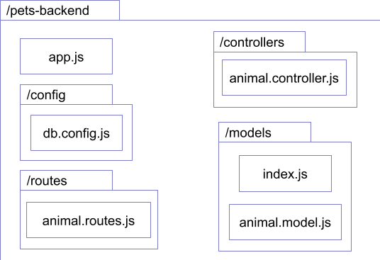

# Week 09 - Mongoose

This material can be found in this [link](https://codeberg.org/kaduardo/shu-aaf/src/branch/main/week09-Mongoose/).

## 1. Introduction

In this lab we are going to modify the existing petshop application to use Mongoose for handling all database related functionality. You will begin by modifying the back-end application to include mongoose models, and a code reorganisation into routers, controllers and models.
This considers that you have finished with the petshop exercises involving Express and React.js/Vue.js. 

## 2. Set-up and initialising

You must make sure your mongodb server is running before starting.

The first step is to install Mongoose component into your node.js/express project by running the following command:

```bash
npm install mongoose
```

If you want to start from scratch you need to create a new express project (e.g., petshop-backend) and initialise and install all the necessary modules. For example:

```bash
express petshop-backend
cd petshop-backend
npm install body-parser
npm install multer
npm install cors
npm install mongoose
npm update
npm install
```

Now you are ready to start coding.

## 3. Defining the models

To better organise our code the database connection details will be saved in a separate file. Create a directory named `config` in your project folder and then a file named `db.config.js` with the following content:

```javascript
module.exports = {
 url: "mongodb://localhost:27017/petshopdb"
};
```

Create a directory called `models` in your project folder, and inside this directory create file named `index.js` file with the following content:

```javascript
const dbConfig = require("../config/db.config.js");
 
const mongoose = require("mongoose");
mongoose.Promise = global.Promise;
 
const db = {};
db.mongoose = mongoose;
db.url = dbConfig.url;
db.animals = require("./animal.model.js")(mongoose);
 
module.exports = db;
```

Let’s create the model. Create a file name `animal.model.js` inside the `model` folder. Use the following content for this file:

```javascript
module.exports = mongoose => {
 var Animal = mongoose.model(
   "animal",
   mongoose.Schema(
     {
       name: String,
       species: String,
       breed: String,
       age: Number,
       colour: String
     }
   )
 );
   return Animal;
};
```

## 4. Creating controllers

Before we were combining the controller code within the routes. We are now going to separate these following best practices for code organisation.

Create a `controllers` folder within your project folder, and create `animal.controller.js` file with the following content:

```javascript
const db = require("../models");
const Animal = db.animals;
 
// Create and Save a new Animal
exports.create = (req, res) => {
 
};
 
// Retrieve all Animals from the database.
exports.findAll = (req, res) => {
 
};
 
// Find a single Animal with an id
exports.findOne = (req, res) => {
 
};
 
// Update a Animal by the id in the request
exports.update = (req, res) => {
 
};
 
// Delete a Animal with the specified id in the request
exports.delete = (req, res) => {
 
};
 
// Delete all Animal from the database.
exports.deleteAll = (req, res) => {
 
};
```

Notice how these functions abstract away from the actual REST method used in the request. This is handled by the router. Let’s now implement some of those functions.

This is the code to create and save a new Animal in the database:

```javascript
// Create and Save a new Animal
exports.create = (req, res) => {
 // Validate request
 if (!req.body.name) {
   res.status(400).send({ message: "Content can not be empty!" });
   return;
 }
 
 // Create a Animal model object
 const animal = new Animal({
   name: req.body.name,
   species: req.body.species,
   breed: req.body.breed,
   age: req.body.age,
   colour: req.body.colour
 });
 
 // Save Animal in the database
 animal
   .save()
   .then(data => {
     console.log("Animal saved in the database: " + data);
     res.send(data);
   })
   .catch(err => {
     res.status(500).send({
       message:
         err.message || "Some error occurred while creating the Animal."
     });
   });
};
```

This is the code to retrieve all animals from the database (with support for conditions):

```javascript
// Retrieve all Animals from the database.
exports.findAll = (req, res) => {
 const name = req.query.name;
 //We use req.query.name to get query string from the Request and consider it as condition for findAll() method.
 var condition = name ? { name: { $regex: new RegExp(name), $options: "i" } } : {};
  Animal
   .find(condition)
   .then(data => {
     res.send(data);
   })
   .catch(err => {
     res.status(500).send({
       message:
         err.message || "Some error occurred while retrieving Animals."
     });
   });
};
```

## 5. Creating routers

Now that we created our controllers we need to update our routes. Within the `routes` folder of your project, create a file named `animal.routes.js` with the following content:

```javascript
var express = require('express');
var router = express.Router();
 
//Require controller
var animalController = require('../controllers/animal.controller');
 
router.get('/', function(req, res, next) {
 res.json({message: "Welcome to the petshop api."});
});
 
// Create a new pet
router.post("/pets/", animalController.create);
 
// Retrieve all animals
router.get("/pets/", animalController.findAll);
 
// Retrieve a single pet with id
router.get("/pets/:id", animalController.findOne);
 
// Update a pet with id
router.put("/pets/:id", animalController.update);
 
// Delete a pet with id
router.delete("/pets/:id", animalController.delete);
 
// Delete all animals of the database
router.delete("/pets/", animalController.deleteAll);
 
module.exports = router;
```

## 6. Connecting to the database

Now we need to configure and create the connection to our database. In our previous code this connection was inside the router (`routes/animal.routes.js`).
Since we are moving to a more organised fashion, with the use of mongoose models, the connection code will now reside in the main file `app.js`. We also need to import the router into the main file. The following content can be used as starting point for your `app.js` file (feel free to modify it as you see fit for your project):

```javascript
var createError = require('http-errors');
var express = require('express');
var path = require('path');
var cookieParser = require('cookie-parser');
var logger = require('morgan');

// Adding extra modules
var bodyParser = require("body-parser");
var cors = require('cors');

// adding the new router
var animalRouter = require('./routes/animal.routes');

var app = express();

// adding cors module
app.use(cors());

// view engine setup
app.set('views', path.join(__dirname, 'views'));
app.set('view engine', 'pug');

app.use(logger('dev'));
app.use(express.json());
app.use(express.urlencoded({ extended: false }));
app.use(cookieParser());
app.use(express.static(path.join(__dirname, 'public')));

// parse requests of content-type - application/json
app.use(bodyParser.json());
// parse requests of content-type - application/x-www-form-urlencoded
app.use(bodyParser.urlencoded({ extended: true }));

//Database connection code
const db = require("./models");
db.mongoose.connect(db.url, {
    useNewUrlParser: true,
    useUnifiedTopology: true
}).then(() => {
    console.log("Connected to the database!");
}).catch(err => {
    console.log("Cannot connect to the database!", err);
    process.exit();
});

// Configuring the main routes
app.use('/petshop', animalRouter);

// catch 404 and forward to error handler
app.use(function(req, res, next) {
    next(createError(404));
});

// error handler
app.use(function(err, req, res, next) {
    // set locals, only providing error in development
    res.locals.message = err.message;
    res.locals.error = req.app.get('env') === 'development' ? err : {};

    // render the error page
    res.status(err.status || 500);
    res.render('error');
});
 
module.exports = app;
```

Notice the following points:

- Importing of the new router: 
```javascript
var animalRouter = require('./routes/animal.routes');
```
- Association of the router with the `/petshop` path:
```javascript
app.use('/petshop', animalRouter);
```
- Code for controlling the connection to the database:
```javascript
//Database connection code
const db = require("./models");
db.mongoose.connect(db.url, {
    useNewUrlParser: true,
    useUnifiedTopology: true
}).then(() => {
    console.log("Connected to the database!");
}).catch(err => {
    console.log("Cannot connect to the database!", err);
    process.exit();
});
```

Save the files and start both mongodb (using the mongod command) and your express back-end application (using the npm start command). You should now be able to list all the animals in your database by accessing the following url: <http://localhost:3050/petshop/pets> if you are reusing the previous project and <http://localhost:3000/petshop/pets> if you created a new project from scratch.

Try the following URLs and make a note of what happens:

- <http://localhost:3050/petshop/>
- <http://localhost:3050/petshop/pets>
- <http://localhost:3050/>
- <http://localhost:3050/petshop/pets/2>

You can now use your previous developed front-end application to connect to your back-end.

For your reference, the figure below shows the general organisation for your code. Considering that the main folder of your project is named petshop-backed it is possible to notice different folders for the main components of your application.



## Exercises

1. Modify your front-end application form to submit new animals to the back-end. 
2. Create the rest of the controller functions. You can use this tutorial as basis for defining your database manipulation functions <https://bezkoder.com/node-express-mongodb-crud-rest-api/>
3. Update your front-end to fully implement all CRUD functions.
4. [extra] Based on the discussions over API design, evaluate the current API of the petshop application. Make the necessary changes to fix the API in order to follow best practices and add any additional functionality you feel is necessary.

## References
Mozilla Developer Network - Express web framework (Node.js/JavaScript) - https://developer.mozilla.org/en-US/docs/Learn/Server-side/Express_Nodejs


