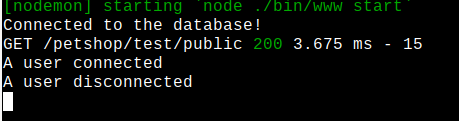

# Week 15 - User Authentication

This material can be found in this [link](https://codeberg.org/kaduardo/shu-aaf/src/branch/main/week16-socket-io/).

## 1. Introduction

In this lab we are going to explore socket.io to implement a basic chat functionality into our petshop application.

As usual, we consider the previous week (User Authentication) sample solution as starting point.
Make sure to adapt the instruction to reflect your own code.

Make sure your application is working before starting.

- Mongodb database pointing to the correct `dbpath`.
- Back-end ready to go - `nodemon start` (don't forget to run `npm install` if you are using one of the sample solutions).
- Front-end ready to go (React or vue).

Check that both the front-end and back-end are working. 

## 2. Adding Socket.io to the back-end

First let's add socket.io module into our back-end application.

```bash
npm install socket.io
```

Create a new controller, so all chat related functions are in a single place.
Use the code below for your `controllers/chat.controller.js`:

```javascript
module.exports.respond = function(endpoint,socket){
    console.log("A user connected");

    socket.on('disconnect', () => {
        console.log("A user disconnected");
    });
}
```

Now let's import the new controller into our main `app.js` file. Include the following code:

```javascript
//...

// Creating the chat socket
var chatSocket = require('socket.io')(
    {
        cors: {
            origins: ['http://localhost:8080']
        }
    }
);
// Importing the chat controller
var chatController = require('./controllers/chat.controller');

var chat = chatSocket
  .of('/chat') //We are defining an endpoint for the chat
  .on('connection', function (socket) {
      chatController.respond(chat,socket);
  });

//... rest of the file

// Modifying app.js to export both the main module and the chat socket
module.exports = { app, chatSocket };
```

Don't forget to modify the last line of the `App.js` file to export both the app component and the chat socket.

Socket.io works by listening for events on the http server object. 
However, since we used express-generator to initialise our back-end, this is handled by the `bin/www` file (the same one we modified to change our back-end to listen on port 3050).

We need to modify this file to import the chat socket and then to register it in the http server object.

**Pay attention to the comments in this code.**

```javascript
//Modify the import of app to consider chatSocket
var {app, chatSocket} = require('../app');

//...

//After the http server is created...
var server = http.createServer(app);
//...we attach the server to the chatSocket
chatSocket.attach(server);

//... rest of the file
```

## 3. Adding Socket.io to the front-end

We now need to modify our front-end to include a chat client.

First import the project dependencies:

```bash
npm install socket-io-client
```

We'll now create a new vue component, so we can concentrate all chat related functionalities in a single place.

Inside `components` create a file named `ChatPage.vue` with the following content:

```javascript
<template>
  <div class="card mt-3">
    <div class="card-body">
      <div class="card-title">
        <h3>Chat Group</h3>
        <hr>
      </div>
      <div class="card-body">
        <div class="messages" v-for="(msg, index) in messages" :key="index">
          <p><span class="font-weight-bold">{{ msg.user }}: </span>{{ msg.message }}</p>
        </div>
      </div>
    </div>
    <div class="card-footer">
      <form @submit.prevent="sendMessage">
        <div class="gorm-group">
          <label for="user">User:</label>
          <input type="text" v-model="user" class="form-control">
        </div>
        <div class="gorm-group pb-3">
          <label for="message">Message:</label>
          <input type="text" v-model="message" class="form-control">
        </div>
        <button type="submit" class="btn btn-success">Send</button>
      </form>
    </div>
  </div>
</template>

<script>
import io from 'socket.io-client';

export default {
  name: "ChatPage",
  data() {
    return {
      user: '',
      message: '',
      messages: [],
      socket : io('localhost:3050/chat')
    }
  },
  methods: {
    sendMessage(e) {
      e.preventDefault();
      //placeholder for sending message
    }
  }
}
</script>
```

Notice how We use standard hooks (`mounted`) for start listening for events.

We now need to define routes for our new page and add it to the navigation bar.

Our current front-end contains routes for managing animals and users, as well as demonstrating the access to public and protected resources.
We'll add a new route for the chat component we created.
Modify you `router.js`.

```javascript
//Existing import commands
//...

Vue.use(Router);

const router = new Router ({
  mode: 'history',
  routes: [
  // Code for existing routes
  //...

  //new routes
    {
      path: '/chat',
      name: 'chat',
      component: () => import('./components/ChatPage')
    }
  ]
});

export default router;
```

Don't forget to include the new route in the list of public pages by modifying the `router.beforeEach()`:

```javascript
//...Existing code

router.beforeEach((to, from, next) => {
  const publicPages = ['/login', '/register', '/public', '/chat'];

//...Rest of the file
```

Now that the routes have been defined we can use them to update our navigation bar.

In this example we are using icons from the fontawesome package and thus need to add any icon to make it available.
Modify the `main.js` file to include the icon for `comments`.

```javascript
//... Existing code

import {
  faHome,
  faUser,
  faUserPlus,
  faSignInAlt,
  faSignOutAlt,
  faComments  //<=== We are adding this element
} from '@fortawesome/free-solid-svg-icons';

library.add(faHome, faUser, faUserPlus, faSignInAlt, faSignOutAlt, faComments);

//... existing code
```
Now create a new link in the navigation bar inside the main `App.vue` file.

```javascript
//Existing code
//...
//New navbar items
        <li class="nav-item">
          <router-link to="/chat" class="nav-link">
            <font-awesome-icon icon="comments" />Chat
          </router-link>
        </li>
//end new navbar items
```

Save everything and start your front-end with 

```bash
npm run serve
```

You should see messages in your back-end console indicating that a user connected when you navigate to the `/chat` page, and that a user disconnected when you close the browser window with the front-end.



## 4. Handling and responding to events

Now let's create a new event handler for dealing with chat messages.
We are naming this event `SEND_MESSAGE` and handle it by printing the received message in the console and broadcasting a `MESSAGE` event to all connected users using the `emit` call.

In the back-end, modify your `chat.controller.js` to include the new handler:

```javascript
module.exports.respond = function(endpoint,socket){
    console.log("A user connected");

    socket.on('disconnect', () => {
        console.log("A user disconnected");
    });

    // registering a new event
    socket.on('SEND_MESSAGE', (msg) => {
        console.log('Server Received: ' + JSON.stringify(msg));
        endpoint.emit('MESSAGE',  msg);
    });
}
```

We need to modify our front-end to send the `SEND_MESSAGE` event and then to listen to the `MESSAGE` event.

In our front-end, modify the chat component `ChatPage.vue`.
We'll add a call to `emit` a message to the back-end and a listener that waits for `MESSAGE` event, printing the received message in the console, and pushing it to the `messages` array, so it can be displayed in the page.
Add the following code inside the `<script>` section of `ChatPage.vue`:


```javascript
//... existing code
  methods: {
    sendMessage(e) {
      e.preventDefault();

      this.socket.emit('SEND_MESSAGE', {
          user: this.user,
          message: this.message
      });
      this.message = '';
    }
  },
  mounted() {
    this.socket.on('MESSAGE', (data) => {
      console.log("Client Received: " + JSON.stringify(data));
      this.messages.push(data);
    });
  }
//... rest of the file
```

Notice how we use the `mounted()` hook to listen for `MESSAGE` events.

You should see the console messages in both your back-end and front-end (remember to use the developer tools of your browser to see the console messages).
You should also see the chat messages.
Open different browser windows and have a go at your chat.

## 5. Exercises

Based on the previous implementation with authentication, consider the following suggestions of improvement:

- Protect the chat page for authenticated users.
    - How to obtain the chat user name from the logged in user?
- Create a chat history functionality
    - How to store chat messages in the database?
- Consider the addition of different _chat rooms_.
    - How to allow an user to change rooms while retaining the chat history of each room?

## References and extra reading

- Jaouad Ballat - Basic Chat Web App using Express.js, Vue.js & Socket.io - <https://medium.com/@jaouad_45834/basic-chat-web-app-using-express-js-vue-js-socket-io-429588e841f0>
- Socket.io Get started - <https://socket.io/get-started/chat>
- Deepinder Singh - Creating a Real time chat app with Vue, Socket.io and NodeJS - <https://deepinder.me/creating-a-real-time-chat-app-with-vue-socket-io-and-nodejs>
- Stack overflow - Use socket.io in controllers - <https://stackoverflow.com/questions/19559135/use-socket-io-in-controllers>
- Sanath Kumar - Building a simple real-time chat application using Socket.io, Express and Vue JS - <https://medium.com/@msanathkumar/building-a-simple-real-time-chat-application-using-socket-io-express-and-vue-js-d263c08a4c59>
